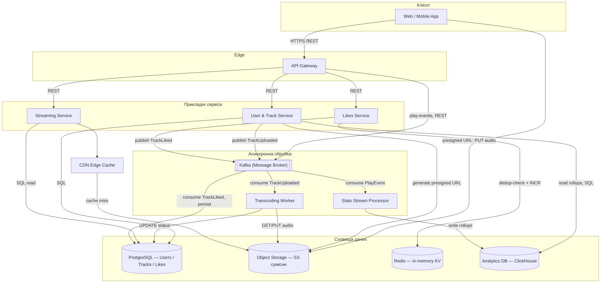
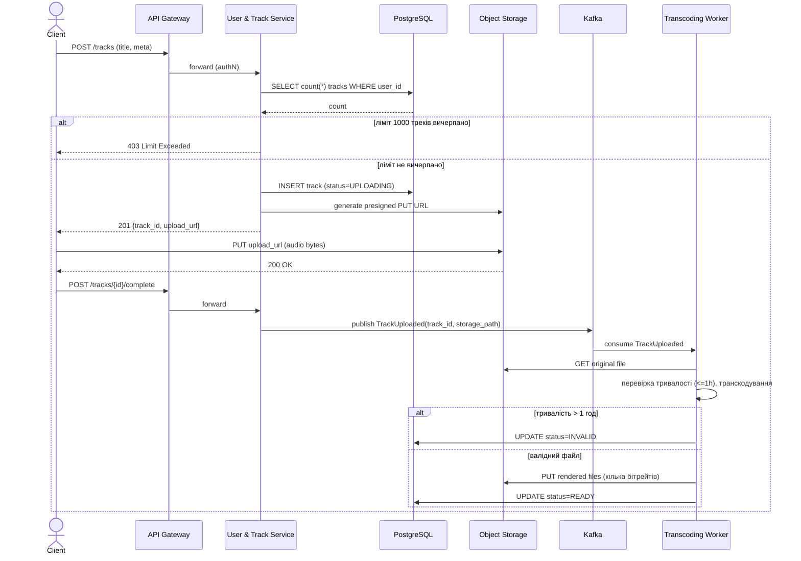
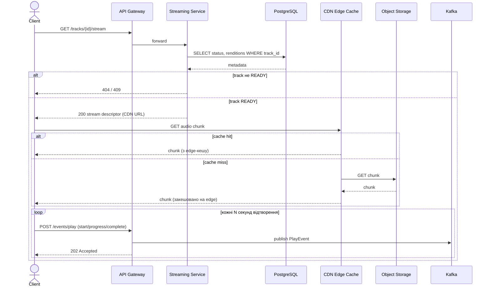
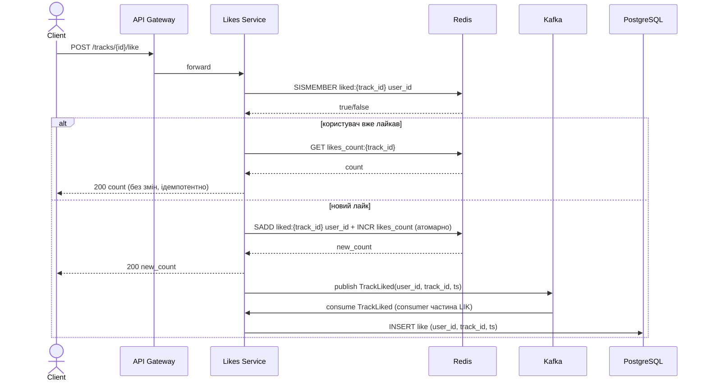
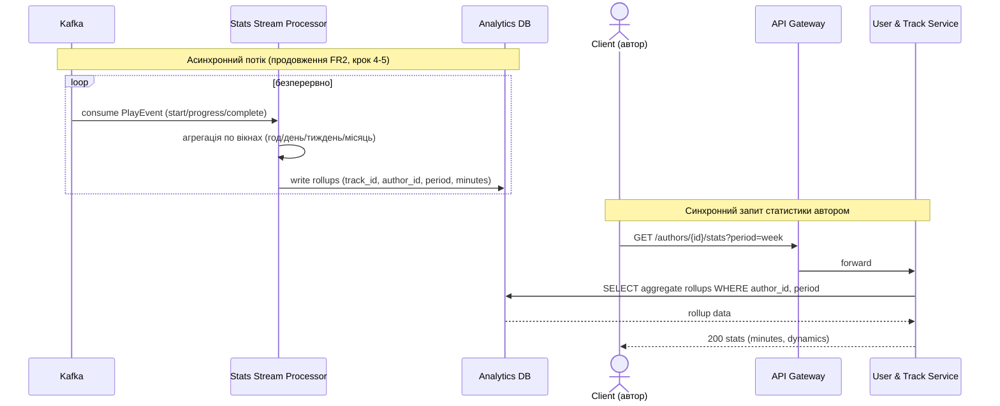

# Домашня робота: Дизайн системи SoundCloud

**Функціональні вимоги:**

1. Користувач може завантажувати на платформу аудіофайли.
2. Користувач може прослуховувати свої або чиїсь аудіофайли на платформі.
3. Користувач може ставити «лайки» трекам.
4. Користувач може бачити статистику прослуховувань (кількість прослуханих хвилин, динаміку за різні періоди часу) своїх аудіофайлів.

**Нефункціональні вимоги:**

1. Кожен користувач може завантажувати до 1000 треків, тривалістю до 1 год кожен.
2. Кількість лайків, яка показується слухачеві, є актуальною із затримкою до 10 сек.
3. Орієнтовна загальна кількість користувачів — 100 млн, орієнтовна денна кількість користувачів (DAU) — 10 млн.

Ключове архітектурне рішення, яке визначає дизайн: вимога до свіжості лічильника лайків (≤10 сек) — м'яка, а не строго транзакційна, тому природним рішенням є **in-memory лічильник як швидкий шлях читання/запису** з асинхронною дурабельною персистенцією, а не блокуючий запис у реляційну БД на кожен лайк. Аналогічно, масштаб у 10 млн DAU виправдовує розділення шляхів запису (upload, play-events, likes) через чергу повідомлень, щоб пікові навантаження не било напряму по транзакційній БД.

---

## Діаграма компонентів

---

## Опис компонентів

### 1. API Gateway

Єдина точка входу для всього клієнтського трафіку: приймає HTTPS-запити від Web/Mobile застосунку, термінує TLS, маршрутизує запити до відповідного прикладного сервісу (User & Track Service, Streaming Service, Likes Service) за REST-протоколом. Виконує наскрізні задачі — перевірку токена автентифікації, rate limiting (важливо при 10 млн DAU, щоб один клієнт не перевантажив бекенд), базове логування запитів. Play-events від клієнта (старт/прогрес/завершення відтворення) також проходять через Gateway і публікуються в Kafka, а не обробляються синхронно. Взаємодія з іншими компонентами — виключно REST/HTTP у синхронному режимі. Реалізується на типовому API-gateway інструменті (наприклад Kong, NGINX+auth-плагін, або хмарний managed gateway) — вибір мотивований потребою мати єдину точку контролю безпеки та маршрутизації без дублювання цієї логіки в кожному сервісі.

### 2. User & Track Service

Прикладний веб-сервіс, що керує користувачами (легка автентифікація/профіль) та метаданими треків: створення запису треку при завантаженні, перевірка ліміту 1000 треків на користувача, генерація presigned URL для прямого завантаження файлу в Object Storage, а також обслуговування запитів на перегляд статистики автора (читає агреговані дані з Analytics DB). Взаємодіє з PostgreSQL через SQL для читання/запису метаданих, з Object Storage — для видачі presigned URL, публікує подію `TrackUploaded` у Kafka після реєстрації завантаження. Реалізується як звичайний веб-сервіс (наприклад REST API на Spring Boot / Node.js / FastAPI) — обрано, бо логіка тут переважно CRUD + прості бізнес-правила (ліміти), що не потребує спеціалізованого стрімінгового чи іншого нестандартного рантайму. Горизонтально масштабується — stateless, за потреби додаються репліки за API Gateway.

### 3. PostgreSQL (реляційна БД)

Джерело правди для структурованих даних: користувачі, метадані треків (назва, автор, тривалість, статус обробки, посилання на файл в Object Storage) і дурабельний журнал лайків (хто, коли, який трек лайкнув — для дедуплікації та відновлення лічильника). Дані мають чіткі зв'язки (user↔track, user↔like) і потребують ACID-гарантій при реєстрації треку чи запису лайку, що є природним для реляційної моделі. Взаємодія — прямий SQL-доступ від User & Track Service, Transcoding Worker (оновлення статусу) та Streaming Service (читання метаданих), а також асинхронний запис від консюмера `TrackLiked` з Kafka. Обрано PostgreSQL як реляційну БД через зрілість, підтримку транзакцій та достатню продуктивність для навантаження такого порядку (метадані — набагато менший обсяг запитів, ніж стрімінг аудіо чи play-events), з можливістю read-реплік при рості читань.

### 4. Object Storage (S3-сумісне)

Зберігає бінарні аудіофайли — оригінали, завантажені користувачем, та транскодовані рендери для стрімінгу (декілька бітрейтів/форматів). Клієнт завантажує файл напряму в Object Storage за presigned URL, отриманим від User & Track Service — це знімає навантаження передачі великих файлів з прикладних серверів. Transcoding Worker читає оригінал і записує назад готові рендери; Streaming Service (через CDN) читає файли для віддачі слухачам. Обрано об'єктне сховище (аналог Amazon S3) замість блочного/файлового, оскільки аудіофайли — незмінні (immutable) блоби без потреби у файловій ієрархії чи випадковому записі, а об'єктні сховища дають практично необмежену горизонтальну масштабованість та високу дурабельність (11 дев'яток) за низької вартості на гігабайт, що критично при мільйонах треків.

### 5. Kafka (Message Broker)

Подієва шина, що декаплить продюсерів і консюмерів для трьох типів подій: `TrackUploaded` (запуск транскодування), `TrackLiked` (асинхронна персистенція лайку), `PlayEvent` (дані для статистики прослуховувань). Замість синхронних викликів між сервісами, продюсер публікує подію в топік і одразу звільняється, а консюмери (Transcoding Worker, Likes-персистер, Stats Stream Processor) обробляють її у власному темпі. Це особливо важливо для `PlayEvent`, обсяг яких при 10 млн DAU може суттєво перевищувати кількість треків чи лайків, і для яких не потрібна синхронна відповідь клієнту. Обрано Kafka (а не просту чергу типу RabbitMQ) через потребу в високій пропускній здатності, збереженні порядку подій у межах партиції (важливо для коректної агрегації по треку) та можливості кількох незалежних груп консюмерів читати той самий потік подій (наприклад, статистика і аудит одночасно).

### 6. Transcoding Worker

Асинхронний обробник, що консюмить подію `TrackUploaded` з Kafka: завантажує оригінальний файл з Object Storage, валідує тривалість (відхиляє/позначає помилковим трек, довший за 1 год — нефункціональна вимога 1), перекодовує аудіо у формати/бітрейти, придатні для адаптивного стрімінгу, завантажує рендери назад в Object Storage і оновлює статус треку в PostgreSQL на `READY`. Працює як пул воркерів, що читають з Kafka-топіка (consumer group), що дозволяє горизонтально масштабувати обробку під час пікових завантажень без впливу на синхронний шлях завантаження файлу користувачем. Реалізується як окремий бекенд-сервіс/воркер (наприклад на базі FFmpeg під капотом) — винесений в окремий асинхронний компонент, а не частину User & Track Service, тому що транскодування — CPU-інтенсивна операція з непередбачуваною тривалістю, яку не можна виконувати в синхронному HTTP-запиті.

### 7. Streaming Service + CDN

Streaming Service відповідає за видачу треку слухачеві: за запитом клієнта читає метадані треку (шлях до рендерів, доступність) з PostgreSQL і повертає клієнту посилання/чанки для відтворення, які фактично обслуговуються CDN-шаром — розподіленим мережевим кешем, що зберігає популярні аудіочанки ближче до користувача географічно. При cache miss CDN звертається до Object Storage за оригінальним чанком і кешує його для наступних запитів. Такий поділ (легкий Streaming Service для метаданих + CDN для важкого трафіку байтів) знімає з бекенду основне мережеве навантаження стрімінгу — при мільйонах одночасних прослуховувань це критично для витрат і затримки. CDN обрано як стандартний інструмент для розподілу статичного/квазістатичного медіаконтенту (наприклад CloudFront/Fastly) — географічна близькість до користувача напряму знижує час до початку відтворення.

### 8. Likes Service

Обробляє запит «лайкнути трек»: перевіряє в Redis, чи користувач вже лайкав цей трек (dedup-set), і якщо ні — атомарно інкрементує лічильник лайків треку в Redis (`INCR`) та одразу повертає клієнту оновлене значення. Паралельно публікує подію `TrackLiked` у Kafka для асинхронного дурабельного запису в PostgreSQL — це джерело правди на випадок відновлення Redis після збою та для майбутньої аналітики (хто лайкав). Такий поділ «швидкий синхронний шлях у Redis + асинхронна персистенція» безпосередньо задовольняє нефункціональну вимогу свіжості лічильника ≤10 сек — фактично читання відбувається з затримкою в мілісекунди, оскільки Redis оновлюється синхронно в момент лайку. Реалізується як легкий stateless-сервіс за API Gateway, взаємодія з Redis — по протоколу Redis (TCP), з Kafka — публікація подій.

### 9. Redis (in-memory KV)

In-memory ключ-значення сховище, що зберігає два типи даних: лічильники лайків по треку (для швидкого читання/запису) та dedup-множини (`user_id:track_id`) для запобігання повторним лайкам від того самого користувача. Всі читання лічильника лайків (наприклад, при відображенні картки треку) обслуговуються напряму з Redis, а не з PostgreSQL, що дає сабмілісекундну затримку читання і знімає навантаження з реляційної БД при мільйонах переглядів на день. Обрано саме in-memory KV-сховище (Redis) через потребу в атомарних лічильниках (`INCR`) і множинах (`SADD`/`SISMEMBER`) з дуже низькою затримкою — ці структури даних нативно підтримуються Redis і не потребують складних SQL-запитів. Дані в Redis вважаються кешем швидкого доступу, а не єдиним джерелом правди — при втраті вузла лічильники можуть бути відновлені з дурабельного журналу лайків у PostgreSQL.

### 10. Stats Stream Processor

Асинхронний консюмер топіка `PlayEvent` у Kafka: обробляє події старту/прогресу/завершення прослуховування, агрегує кількість прослуханих хвилин по треку та автору і формує time-bucketed rollups (по годині/дню/тижню/місяцю), які записує в Analytics DB. Обробка потокова (stream processing), а не пакетна раз на добу, оскільки обсяг play-events при 10 млн DAU великий і рівномірне навантаження на обробку зручніше, ніж великі нічні batch-джоби. Взаємодіє з іншими компонентами виключно через Kafka (читання) та Analytics DB (запис) — жодних синхронних викликів. Реалізується на інструменті потокової обробки (наприклад Kafka Streams або Apache Flink) — обрано через нативну інтеграцію з Kafka та вбудовану підтримку віконної (windowed) агрегації, потрібної для рollups за різні періоди.

### 11. Analytics DB (ClickHouse / OLAP)

Окреме аналітичне сховище агрегованої статистики прослуховувань (хвилини прослуховування, кількість прослуховувань, розбивка за періодами) для кожного треку/автора. Читається User & Track Service при відображенні дашборду статистики автору, записується Stats Stream Processor. Винесено в окреме сховище від транзакційної PostgreSQL навмисно: аналітичні запити (агрегації, групування за часовими вікнами, сканування великих обсягів rollup-рядків) мають зовсім інший профіль навантаження, ніж точкові транзакційні запити метаданих, і змішування їх в одній БД деградувало б продуктивність обох сценаріїв. Обрано колонкову OLAP-БД (наприклад ClickHouse) через її ефективність саме для агрегаційних запитів по часових рядах при великому обсязі даних (мільйони play-events на день), значно швидшу за реляційну БД для такого типу запитів.

---

## Проходження даних для функціональних вимог

Для кожної функціональної вимоги нижче наведено (1) докладний текстовий опис повного шляху даних по системі — з конкретними HTTP-методами/шляхами, орієнтовним складом payload/подій та обробкою помилкових гілок, і (2) sequence-діаграму (mermaid), що візуалізує ту саму послідовність взаємодій між компонентами. Імена учасників на діаграмах відповідають вузлам компонентної діаграми вище (Client, GW, UTS, STR, LIK, MQ, TC, SP, PG, OS, RD, CH, CDN).

### FR1. Завантаження аудіофайлу

**Текстовий опис**

1. Клієнт надсилає `POST /tracks` (тіло: `title`, `user_id`, орієнтовна тривалість/розмір файлу) через API Gateway до User & Track Service. Gateway перевіряє токен автентифікації перед маршрутизацією.
2. User & Track Service рахує поточну кількість треків користувача в PostgreSQL і звіряє з лімітом 1000 (нефункціональна вимога 1). Якщо ліміт вичерпано — одразу повертається `403 Limit Exceeded`, і жоден байт файлу ще не передавався.
3. Якщо перевірка пройшла — сервіс виконує `INSERT` запису треку в PostgreSQL зі статусом `UPLOADING` (поля: `track_id`, `user_id`, `title`, `status`, `created_at`) і викликає Object Storage SDK для генерації presigned PUT URL (з обмеженим TTL, наприклад 15 хв). У відповіді `201 Created` клієнту повертаються `track_id` і `upload_url`.
4. Клієнт виконує `PUT upload_url` напряму в Object Storage з бінарним вмістом файлу — запит не проходить через жоден прикладний сервер, що знімає навантаження bandwidth з бекенду.
5. Після підтвердження успішного `PUT` (клієнт викликає `POST /tracks/{id}/complete`, або Object Storage надсилає event-notification) User & Track Service публікує подію `TrackUploaded` (поля: `track_id`, `storage_path`, `uploaded_at`) у топік Kafka.
6. Transcoding Worker консюмить `TrackUploaded`, завантажує оригінал з Object Storage (`GET`), обчислює фактичну тривалість. Якщо вона перевищує 1 год (нефункціональна вимога 1) — трек позначається `INVALID`, обробка зупиняється; інакше файл перекодовується в кілька бітрейтів/форматів для адаптивного стрімінгу.
7. Готові рендери записуються (`PUT`) назад в Object Storage за окремими ключами (по бітрейту/формату); статус треку в PostgreSQL оновлюється `UPDATE ... SET status='READY'`. З цього моменту трек видимий для прослуховування (FR2).

**Діаграма послідовності**

### FR2. Прослуховування треку (свого чи чужого)

**Текстовий опис**

1. Клієнт викликає `GET /tracks/{id}/stream` через API Gateway → Streaming Service.
2. Streaming Service читає з PostgreSQL метадані треку (`status`, посилання на рендери, `user_id` автора для перевірки доступності). Якщо статус не `READY` — повертається `404`/`409`; інакше повертається `200` зі stream-дескриптором (перелік доступних бітрейтів і базовий CDN-URL для чанків).
3. Клієнт запитує аудіочанки напряму у CDN за отриманим URL. При cache hit чанк віддається з edge-вузла (низька затримка, найпоширеніший сценарій для популярних треків). При cache miss CDN звертається до Object Storage (`GET`), отримує чанк, кешує його на edge-вузлі і повертає клієнту.
4. Паралельно з відтворенням клієнт кожні N секунд надсилає play-event через `POST /events/play` (поля: `track_id`, `user_id`, `event_type` ∈ {`start`, `progress`, `complete`}, `position_sec`) через API Gateway.
5. API Gateway публікує подію в топік `PlayEvent` у Kafka і одразу повертає клієнту `202 Accepted` — подальша обробка статистики (FR4) повністю відв'язана від цього синхронного шляху й не впливає на відтворення.

**Діаграма послідовності**

### FR3. Лайк треку

**Текстовий опис**

1. Клієнт надсилає `POST /tracks/{id}/like` (поля: `user_id`) через API Gateway до Likes Service.
2. Likes Service виконує `SISMEMBER liked:{track_id} user_id` у Redis — перевірка, чи цей користувач уже лайкав трек.
3. Якщо так — операція ідемпотентна: сервіс одразу повертає поточне значення `likes_count:{track_id}` без повторного інкременту.
4. Якщо лайк новий — атомарно (наприклад через Redis-транзакцію/Lua-скрипт) виконуються `SADD liked:{track_id} user_id` та `INCR likes_count:{track_id}`; оновлене значення лічильника повертається клієнту в `200 OK` практично одразу (затримка — одиниці мілісекунд, з великим запасом виконує нефункціональну вимогу ≤10 сек свіжості).
5. Паралельно (не блокуючи відповідь клієнту) Likes Service публікує подію `TrackLiked` (поля: `user_id`, `track_id`, `liked_at`) у Kafka.
6. Окремий консюмер у складі Likes Service читає `TrackLiked` і виконує `INSERT` дурабельного запису лайку в PostgreSQL — це джерело правди для відновлення лічильників Redis після збою кешу та база для майбутньої аналітики («хто лайкнув»).
7. Будь-який клієнт, що переглядає картку треку (`GET /tracks/{id}`), отримує актуальний лічильник лайків, прочитаний напряму з Redis (`GET likes_count:{track_id}`), а не з PostgreSQL.

**Діаграма послідовності**

### FR4. Статистика прослуховувань власних треків

**Текстовий опис**

1. Play-events, згенеровані на кроках 4-5 FR2, накопичуються в топіку `PlayEvent` у Kafka (поля: `track_id`, `user_id`, `event_type`, `position_sec`, `ts`).
2. Stats Stream Processor безперервно консюмить топік, з пар `progress`/`complete`-подій обчислює тривалість прослуховування за сесію і агрегує по `track_id`/`author_id` у часові вікна (година, день, тиждень, місяць) за допомогою windowed-агрегації.
3. Агреговані rollups (поля: `track_id`, `author_id`, `period_start`, `period_type`, `listened_minutes`, `play_count`) записуються в Analytics DB (ClickHouse) — окремо від транзакційної PostgreSQL, щоб не змішувати OLTP- і OLAP-навантаження.
4. Коли автор відкриває сторінку статистики, клієнт викликає `GET /authors/{id}/stats?period=week` через API Gateway до User & Track Service.
5. User & Track Service виконує аналітичний запит (агрегація по rollup-рядках за обраний період) до Analytics DB і повертає клієнту `200 OK` з даними для графіків (загальна кількість прослуханих хвилин, динаміка за період).

Такий шлях гарантує, що важкий потік play-events (найбільший за обсягом серед усіх подій при 10 млн DAU) не створює навантаження на транзакційну БД метаданих і не блокує основний шлях прослуховування (FR2), оскільки обробляється повністю асинхронно й окремо.

**Діаграма послідовності**

