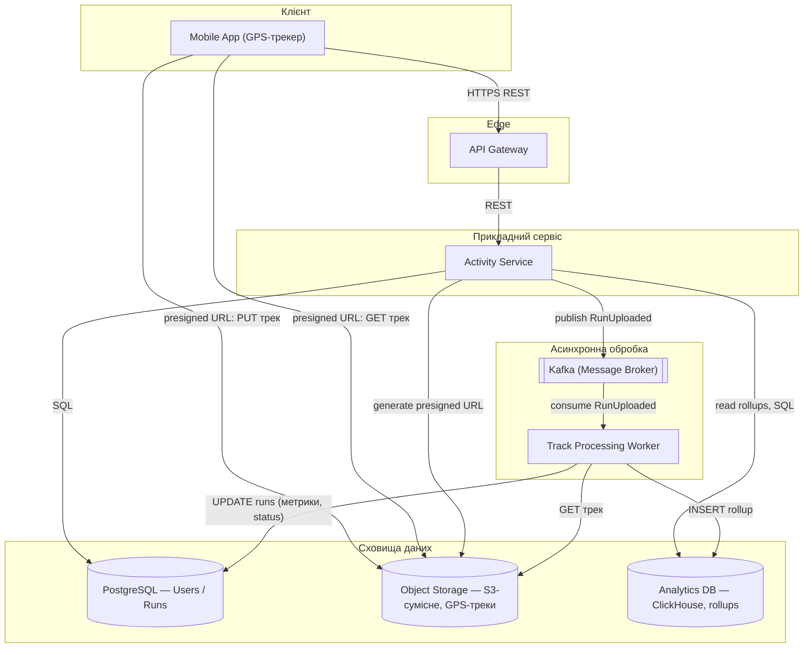
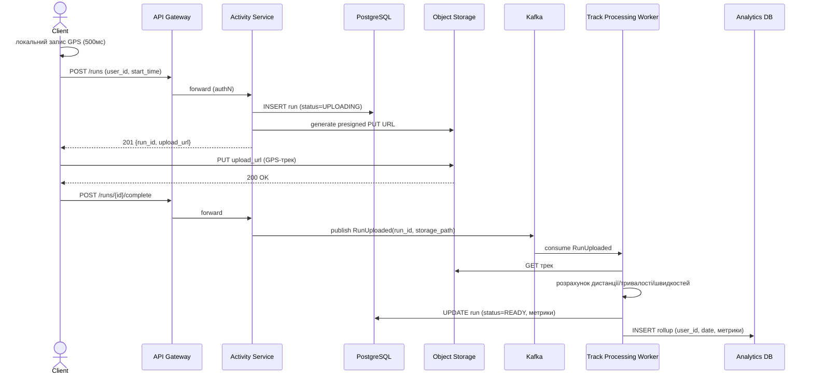
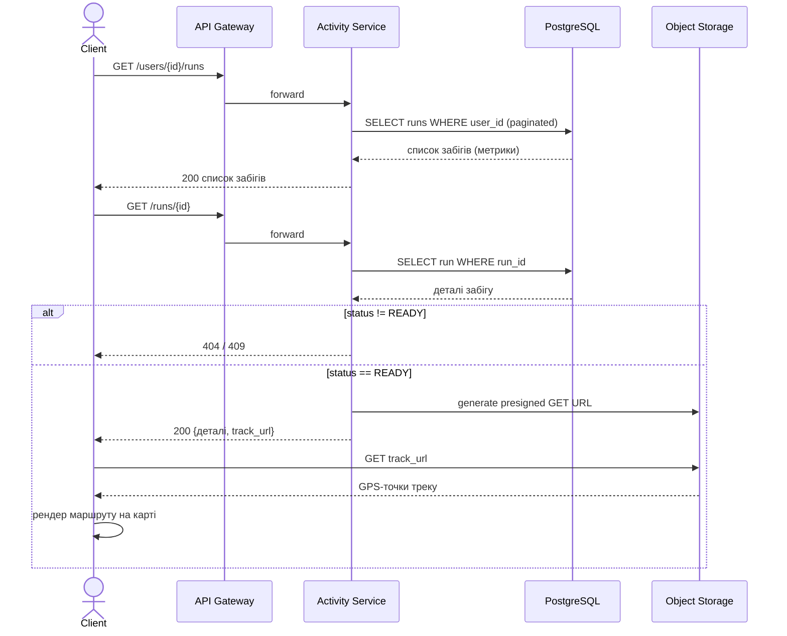
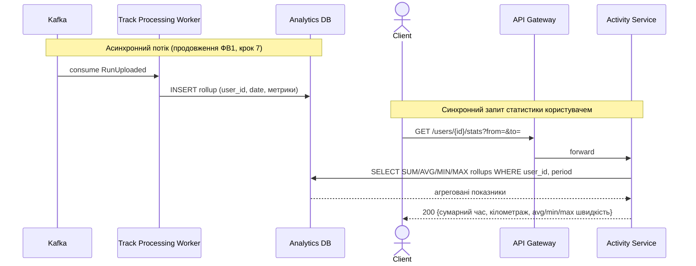

# Домашня робота: Дизайн системи Strava (бігова аналітика)

**Функціональні вимоги:**

1. Система повинна дозволяти користувачам записувати детальну інформацію про свої забіги (running tracker).
2. Користувач повинен мати можливість переглянути всі свої попередні забіги (з візуалізацією на карті). Дані повинні містити тривалість, довжину, середню та максимальну швидкість переглядуваного забігу.
3. Користувач має можливість подивитися агреговану статистику про свої заняття спортом за вибраний період часу. Ця статистика за обраний період повинна містити як мінімум: сумарний час бігу, сумарний кілометраж, середню швидкість, мінімальну/максимальну швидкість.

**Нефункціональні вимоги:**

1. Частота забору гео-даних — з інтервалом в 500 мс.
2. Система зберігає інформацію про всі тренування протягом 10 років.
3. Орієнтовна загальна кількість користувачів — 50 млн. Орієнтовна денна кількість активних користувачів — 10 млн.

Ключові архітектурні рішення, що визначають дизайн:

1. **Запис GPS відбувається повністю on-device.** Клієнт локально буферизує точки з інтервалом 500 мс (НФВ1) і надсилає на бекенд уже завершений трек одним файлом по завершенню забігу — без live-стрімінгу окремих точок і без утримання мільйонів "живих" з'єднань при 10 млн DAU.
2. **Трек — блоб в Object Storage, а не рядки в реляційній БД.** Семплінг 500 мс дає великий обсяг точок на один забіг (наприклад ≈3600 точок на 30-хвилинний забіг); зберігання по точці в PostgreSQL не масштабується на роки історії при такій DAU, тому сирий трек зберігається як один об'єкт в S3-сумісному сховищі, а в PostgreSQL — лише компактний рядок агрегованих метрик забігу.
3. **Обробка треку — асинхронна, через чергу повідомлень.** Розрахунок дистанції/швидкостей і формування rollup-рядка для статистики не блокує відповідь на завантаження — окремий пул воркерів консюмить подію і виконує обчислення, що дозволяє горизонтально масштабуватись під пікове навантаження завантажень при 10 млн DAU.
4. **Агрегати за період (ФВ3) обслуговуються окремим колонковим/OLAP-сховищем, а не SQL-агрегацією "на льоту".** Запит статистики за довільний період при 10-річній глибині історії й 10 млн DAU повинен швидко сканувати роки даних; компактні rollup-рядки в колонковій БД дають прийнятну латентність запиту і стиснення для довгострокового зберігання.

---

## Діаграма компонентів

---

## Опис компонентів

### 1. API Gateway

Єдина точка входу для клієнтського трафіку: термінує TLS, перевіряє токен автентифікації, маршрутизує REST-запити до Activity Service і виконує rate limiting, щоб один клієнт не перевантажив бекенд при 10 млн DAU. Взаємодіє з клієнтом і Activity Service виключно по REST/HTTP у синхронному режимі, без власного стану. Реалізується на типовому API-gateway інструменті (наприклад Kong, NGINX з auth-плагіном, або хмарний managed gateway). Обрано через потребу мати єдину точку контролю безпеки й маршрутизації, не дублюючи цю логіку в прикладному сервісі.

### 2. Activity Service

Прикладний веб-сервіс, що обслуговує всі три функціональні вимоги: приймає запит на завантаження завершеного забігу і генерує presigned URL в Object Storage (ФВ1), віддає список і деталі попередніх забігів з PostgreSQL разом з посиланням на трек-об'єкт (ФВ2), і повертає агреговану статистику за період, читаючи rollup-дані з Analytics DB (ФВ3). Взаємодіє з клієнтом через REST/HTTP, з PostgreSQL і Analytics DB — по SQL, з Object Storage — через SDK для видачі presigned URL, з Kafka — публікуючи подію `RunUploaded`. Реалізується як звичайний stateless REST-сервіс (наприклад на Spring Boot / Node.js / FastAPI) і горизонтально масштабується репліками за Gateway. Один сервіс покриває всі три ФВ за зразком аналогічного рішення для SoundCloud — жодна з вимог не має власної специфічної вимоги до свіжості чи пропускної здатності, яка виправдовувала б виділення в окремий сервіс.

### 3. PostgreSQL (реляційна БД)

Джерело правди для структурованих даних: користувачі та записи забігів (`run_id`, `user_id`, `start_time`, `status`, `duration`, `distance`, `avg_speed`, `max_speed`, посилання на трек-об'єкт в Object Storage). Це невеликі структуровані рядки — по одному на забіг, а не на GPS-точку — з чіткими зв'язками (user↔run) і потребою ACID-гарантій при реєстрації забігу та оновленні статусу. Взаємодія — прямий SQL-доступ від Activity Service (читання списку/деталей, ФВ2) і від Track Processing Worker (оновлення метрик і статусу після обробки). Обрано PostgreSQL через зрілість, підтримку транзакцій і достатню продуктивність для такого обсягу запитів — метадані забігів на порядки менші за обсяг сирих GPS-точок.

### 4. Object Storage (S3-сумісне)

Зберігає сирі GPS-треки — послідовності точок (широта/довгота/висота/час) із семплінгом 500 мс — як окремі бінарні об'єкти, по одному на забіг. Клієнт завантажує трек напряму в Object Storage за presigned URL від Activity Service, а при перегляді карти забігу (ФВ2) так само напряму читає трек за presigned GET URL — це знімає передачу об'ємних бінарних даних з прикладного сервера. Track Processing Worker читає той самий об'єкт для розрахунку метрик. Обрано об'єктне сховище через незмінність (immutability) треків, практично необмежену горизонтальну масштабованість і високу дурабельність за низької вартості на гігабайт — критично при 10-річному терміні зберігання (НФВ2) і мільярдах точок на добу в масштабі 10 млн DAU.

### 5. Kafka (Message Broker)

Подієва шина, що публікує подію `RunUploaded` після успішного завантаження треку і декаплить Activity Service від Track Processing Worker: продюсер публікує подію й одразу звільняється, а воркер обробляє її у власному темпі. Це важливо, оскільки парсинг треку та розрахунок метрик — операція з непередбачуваною тривалістю, яку небажано виконувати синхронно в HTTP-запиті при пікових навантаженнях 10 млн DAU. Взаємодія — виключно публікація/консюмація подій, без прямих синхронних викликів між сервісами. Обрано Kafka через потребу у високій пропускній здатності та можливості горизонтально масштабувати споживачів через consumer group під час пікових завантажень.

### 6. Track Processing Worker

Асинхронний обробник, що консюмить подію `RunUploaded`: завантажує трек з Object Storage, парсить послідовність точок і розраховує дистанцію (сума відстаней між послідовними точками), тривалість, середню та максимальну швидкість забігу. Результат записується двома шляхами: оновлення рядка забігу в PostgreSQL (`status=READY`, розраховані метрики — джерело для ФВ2) і вставка rollup-рядка в Analytics DB (джерело для ФВ3). Працює як пул воркерів, що читають з Kafka consumer group, що дозволяє горизонтально масштабувати обробку без впливу на синхронний шлях завантаження. Винесений в окремий асинхронний компонент, а не частину Activity Service, тому що парсинг тисяч точок на забіг — CPU-навантаження з непередбачуваною тривалістю.

### 7. Analytics DB (ClickHouse / OLAP)

Окреме колонкове сховище rollup-рядків статистики забігів (`user_id`, дата, тривалість, дистанція, середня/максимальна швидкість), що записується Track Processing Worker і читається Activity Service при запиті агрегованої статистики за період (ФВ3). Винесено в окреме сховище від транзакційної PostgreSQL навмисно: агрегаційні запити за довільний період при 10-річній глибині історії (НФВ2) і 10 млн DAU мають зовсім інший профіль навантаження, ніж точкові читання метаданих забігу, і змішування їх в одній БД деградувало б продуктивність обох сценаріїв. Обрано колонкову OLAP-БД (наприклад ClickHouse) через ефективність саме для агрегаційних запитів по часових діапазонах при великому обсязі rollup-рядків, значно швидшу за реляційну БД для такого типу запитів.

---

## Проходження даних для функціональних вимог

Для кожної функціональної вимоги нижче наведено (1) докладний текстовий опис повного шляху даних по системі — з орієнтовними HTTP-методами/шляхами, складом payload/подій та обробкою помилкових гілок, і (2) sequence-діаграму (mermaid), що візуалізує ту саму послідовність взаємодій. Імена учасників на діаграмах відповідають вузлам компонентної діаграми вище (Client, GW, AS, PG, OS, MQ, TW, CH).

### FR1. Запис і завантаження забігу

**Текстовий опис**

1. Клієнт локально розпочинає запис забігу — старт і збір GPS-точок з інтервалом 500 мс (НФВ1) відбуваються повністю на пристрої, без звернень до бекенду.
2. Після завершення забігу клієнт надсилає `POST /runs` (тіло: `user_id`, `start_time`, орієнтовний розмір треку) через API Gateway до Activity Service. Gateway перевіряє токен автентифікації перед маршрутизацією.
3. Activity Service виконує `INSERT` запису забігу в PostgreSQL зі статусом `UPLOADING` (`run_id`, `user_id`, `start_time`, `status`) і викликає Object Storage SDK для генерації presigned PUT URL з обмеженим TTL. У відповіді `201 Created` клієнту повертаються `run_id` і `upload_url`.
4. Клієнт виконує `PUT upload_url` напряму в Object Storage з бінарним вмістом треку (послідовність точок) — запит не проходить через прикладний сервер.
5. Після підтвердження `PUT` клієнт викликає `POST /runs/{id}/complete`; Activity Service публікує подію `RunUploaded` (поля: `run_id`, `storage_path`, `uploaded_at`) у Kafka.
6. Track Processing Worker консюмить `RunUploaded`, завантажує трек з Object Storage (`GET`), парсить точки і розраховує дистанцію, тривалість, середню та максимальну швидкість.
7. Worker виконує `UPDATE` запису в PostgreSQL (`status=READY`, розраховані метрики) і `INSERT` rollup-рядка в Analytics DB. З цього моменту забіг видимий у ФВ2 і врахований у ФВ3.

**Діаграма послідовності**

### FR2. Перегляд попередніх забігів з візуалізацією на карті

**Текстовий опис**

1. Клієнт викликає `GET /users/{id}/runs` через API Gateway до Activity Service для отримання списку попередніх забігів.
2. Activity Service виконує пагінований `SELECT` з PostgreSQL і повертає `200 OK` зі списком забігів (дата, тривалість, дистанція, середня/максимальна швидкість — без самого треку).
3. Користувач обирає конкретний забіг: клієнт викликає `GET /runs/{id}`. Activity Service читає деталі запису з PostgreSQL; якщо статус не `READY` — повертається `404`/`409` (обробка ще не завершена); інакше сервіс генерує presigned GET URL до трек-об'єкта в Object Storage і повертає `200` з деталями забігу та `track_url`.
4. Клієнт виконує `GET track_url` напряму в Object Storage, отримує послідовність точок і рендерить маршрут на карті на стороні клієнта.

**Діаграма послідовності**

### FR3. Агрегована статистика за період

**Текстовий опис**

1. Rollup-рядки, що записуються Track Processing Worker на кроці 7 ФВ1, накопичуються в Analytics DB — по одному рядку на завершений забіг з прив'язкою до `user_id` і дати.
2. Користувач обирає період на клієнті й викликає `GET /users/{id}/stats?from=&to=` через API Gateway до Activity Service.
3. Activity Service виконує аналітичний запит до Analytics DB: `SUM` тривалості, `SUM` дистанції, `AVG` середньої швидкості, `MIN`/`MAX` швидкості по rollup-рядках цього `user_id` у заданому діапазоні дат.
4. Activity Service повертає клієнту `200 OK` з агрегованими показниками (сумарний час бігу, сумарний кілометраж, середня швидкість, мінімальна/максимальна швидкість за період).

Такий шлях гарантує, що запит статистики за довільний період не сканує сирі GPS-треки чи роки транзакційних рядків PostgreSQL, а звертається до вже готових компактних rollup-даних, розрахованих асинхронно під час обробки кожного забігу.

**Діаграма послідовності**

